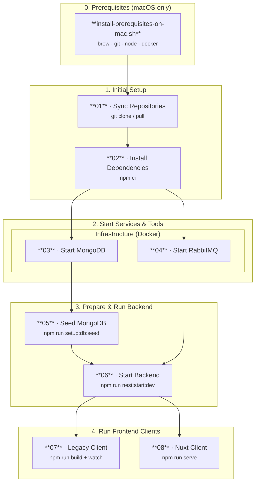

# Local SchulCloud Setup

Scripts for a local deployment of the [SchulCloud](https://github.com/hpi-schul-cloud/schulcloud-server). See https://documentation.dbildungscloud.dev/docs/getting-started for more information.

## Prerequisites (macOS only)

Before running the setup scripts on macOS, install all required tools in one go:

```bash
bash scripts/install-prerequisites-on-mac.sh
```

The script installs each tool only if it is not already present:

| Tool | How it is installed |
|------|---------------------|
| [Homebrew](https://brew.sh) | official install script from `brew.sh` |
| git | `brew install git` |
| Node.js | `brew install node` |
| Docker Desktop | `brew install --cask docker` |

Each step is idempotent — running the script again when a tool is already installed prints an info line and skips the install.

## Steps for a local setup

1. `scripts/01-sync-schulcloud-repos.sh` — sync `schulcloud-server`, `nuxt-client`, and `schulcloud-client` into `repos/`
2. `scripts/02-install-schulcloud-node-deps.sh` — run `npm ci` in each repo
3. `scripts/03-start-mongodb.sh` — start MongoDB via Docker (idempotent: restarts existing container or creates a new one)
4. `scripts/04-start-rabbitmq.sh` — start RabbitMQ via Docker (idempotent: restarts existing container or creates a new one)
5. `scripts/05-seed-mongodb.sh` — seed the MongoDB by running `npm run setup:db:seed` in `schulcloud-server` (skips if already seeded)
6. `scripts/06-start-backend.sh` — start the backend with `npm run nest:start:dev` in `schulcloud-server`
7. `scripts/07-build-and-watch-schulcloud-client.sh` — run `npm run build` and then `npm run watch` in `schulcloud-client`
8. `scripts/08-serve-nuxt-client.sh` — run `npm run serve` in `nuxt-client`



After all steps you access the SchulCloud via

- http://localhost:3000/ - backend
  - note: opening the backend root URL shows a `Page Not Found` response
  - for example http://localhost:3000/api/v3/docs shows the swagger of the `/api/v3/` endpoints
- http://localhost:3100/ - legacy client
  - note: the default view shows an error until you log in
- http://localhost:4000/ - vue client (repo `nuxt-client`)
  - note: the default view shows an error until you log in

Use one of the demo accounts from https://github.com/hpi-schul-cloud/schulcloud-server/blob/main/backup/setup/accounts.json to sign in.
