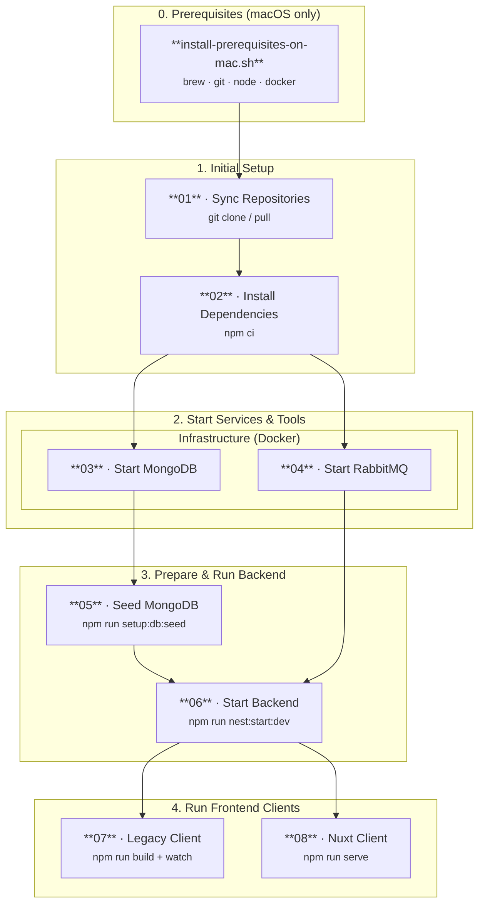

# Local SchulCloud Setup

Scripts for a local deployment of the [SchulCloud](https://github.com/hpi-schul-cloud/schulcloud-server). See https://documentation.dbildungscloud.dev/docs/getting-started for more information.

## Prerequisites (macOS only)

Before running the setup scripts on macOS, install all required tools in one go:

```bash
bash scripts/helper/install-prerequisites-on-mac.sh
```

The script installs each tool only if it is not already present:

| Tool                        | How it is installed                    |
| --------------------------- | -------------------------------------- |
| [Homebrew](https://brew.sh) | official install script from `brew.sh` |
| git                         | `brew install git`                     |
| Node.js                     | `brew install node`                    |
| Docker Desktop              | `brew install --cask docker`           |

Each step is idempotent — running the script again when a tool is already installed prints an info line and skips the install.

## Steps for a local setup

1. `scripts/steps/01-sync-schulcloud-repos.sh` — sync `schulcloud-server`, `nuxt-client`, and `schulcloud-client` into `repos/`
2. `scripts/steps/02-install-schulcloud-node-deps.sh` — run `npm ci` in each repo
3. `scripts/steps/03-start-mongodb.sh` — start MongoDB via Docker (idempotent: restarts existing container or creates a new one)
4. `scripts/steps/04-start-rabbitmq.sh` — start RabbitMQ via Docker (idempotent: restarts existing container or creates a new one)
5. `scripts/steps/05-seed-mongodb.sh` — seed the MongoDB by running `npm run setup:db:seed` in `schulcloud-server` (skips if already seeded)
6. `scripts/steps/06-start-backend.sh` — start the backend with `npm run nest:start:dev` in `schulcloud-server`
7. `scripts/steps/07-build-and-watch-schulcloud-client.sh` — run `npm run build` and then `npm run watch` in `schulcloud-client`
8. `scripts/steps/08-serve-nuxt-client.sh` — run `npm run serve` in `nuxt-client`



After all steps you access the SchulCloud via

- http://localhost:3000/ - backend
  - note: opening the backend root URL shows a `Page Not Found` response
  - for example http://localhost:3000/api/v3/docs shows the swagger of the `/api/v3/` endpoints
- http://localhost:3100/ - legacy client
  - note: the default view shows an error until you log in
- http://localhost:4000/ - vue client (repo `nuxt-client`)
  - note: the default view shows an error until you log in

Use one of the demo accounts from https://github.com/hpi-schul-cloud/schulcloud-server/blob/main/backup/setup/accounts.json to sign in.

## Helper scripts

- `scripts/helper/install-prerequisites-on-mac.sh` — install required macOS tools before running the setup steps
- `scripts/helper/connect-mongodb.sh` — open an interactive `mongosh` shell in the MongoDB container started by `scripts/steps/03-start-mongodb.sh`

## Existing local workspace

If you already have the FWU repositories checked out under `~/code/svs`, start the full local stack without cloning into this repository's `repos/` directory:

```bash
scripts/09-start-existing-svs-workspace.sh
```

The script expects these repositories by default:

- `~/code/svs/schulcloud-server`
- `~/code/svs/nuxt-client`
- `~/code/svs/file-storage`

Override the workspace path with `SVS_WORKSPACE_DIR=/path/to/svs`. Set `SVS_SKIP_SEED=true` to skip `npm run setup:db:seed` and local file fixture seeding on subsequent starts.

It starts MongoDB, RabbitMQ, Redis, MinIO, the optional local calendar server (`~/code/svs/calendar-server/server.mjs`), the backend, file-storage service, and Nuxt client. Logs and process IDs are written to `~/code/svs/.runtime/`.

The normal seed path also creates a small local file fixture set so the file APIs and apps have deterministic data:

- MongoDB `filerecords` for one personal file and one course file
- matching objects in the MinIO `schulcloud` bucket

Useful overrides:

- `SVS_SEED_FILES=false` skips local file fixture seeding.
- `SVS_START_CALENDAR=false` skips the optional local calendar server.
- `SVS_START_LEGACY_CLIENT=false` skips the optional legacy client used for not-yet-native `/files/*` routes.
- `SVS_SKIP_LEGACY_BUILD=true` skips building legacy client assets when `build/default` is missing.
- `SVS_MINIO_BUCKET`, `SVS_MINIO_ROOT_USER`, `SVS_MINIO_ROOT_PASSWORD`, and `SVS_MINIO_ENDPOINT_FOR_CONTAINER` override the local MinIO seed target.
